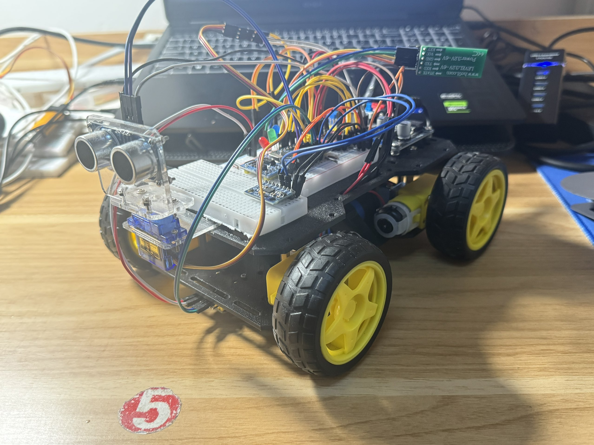

# RS-EC-ThirdCheck
## RS机器人实验室电控组第三轮考核任务

---

### 引脚 + 定时器分配
#### [TIM定时器]
- `TIM1`：定时器定时中断
- `TIM2`：生成PWM波(电机)
- `TIM3`：生成PWM波(舵机)
- `TIM4`：超声波模块定时器定时中断(100 μs)

#### [LED]
- `PA8`：蓝LED
- `PA11`：绿LED
- `PA12`：红LED

---

### 工程日志（并不完整）
- 2025.12.2：完成电机驱动，MPU6050读取，TCS34725读取；MPU6050读取特化；舵机驱动；Copilot优化阻塞的HCSR04驱动
- 2025.12.3：LED控制；基础运动控制
- 2025.12.12：基础的避障
- 2025.12.13：有问题的迷宫算法，未上传
- 2025.12.14：上传了未测试的迷宫算法
- 2025.12.15-2025.12.16：发现了旋转测距的问题，并完成了完善；时间节点安排完善，标志位完善，0过滤，三次均值，更加完备的测距开始信号；介入架构的初始
- 2025.12.17：完善介入架构
- 2025.12.19：尝试新的方法
- 2025.12.20-12.21：完善长廊判定；部分模块出现不执行的问题，交给Copilot进行修改
- 2025.12.22：根据Copilot的思想进行部分代码架构更改
- 2025.12.23：简单的算法优化；注释和变量名修整
- 2025.12.24：21：00考核验收截止，未参加考核

